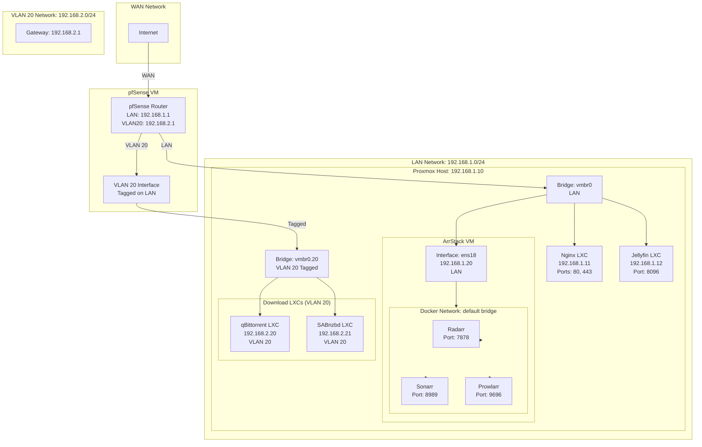
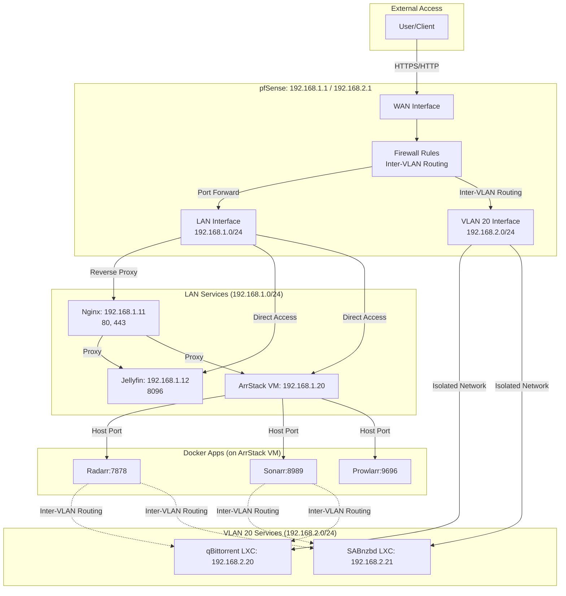

# Networking Documentation

## Network Architecture

### Network Topology



### Network Flow Diagram



## IP Address Assignments

### LAN Network: 192.168.1.0/24

| Device/Service | IP Address | Type | Notes |
|----------------|------------|------|-------|
| pfSense | 192.168.1.1 | VM | Router/Gateway |
| Proxmox Host | 192.168.1.10 | Host | Proxmox management interface |
| Nginx LXC | 192.168.1.11 | LXC | Reverse proxy |
| Jellyfin LXC | 192.168.1.12 | LXC | Media server |
| ArrStack VM | 192.168.1.20 | VM | Docker host - Management Apps |

### VLAN 20 Network: 192.168.2.0/24

| Device/Service | IP Address | Type | Notes |
|----------------|------------|------|-------|
| pfSense (VLAN 20) | 192.168.2.1 | VM | VLAN 20 Gateway |
| qBittorrent LXC | 192.168.2.20 | LXC | Download Client |
| SABnzbd LXC | 192.168.2.21 | LXC | Download Client |

## Port Mappings

### LAN Services (ArrStack VM)

| Service | Port | Protocol | Access |
|---------|------|----------|--------|
| Radarr | 7878 | HTTP | http://192.168.1.20:7878 |
| Sonarr | 8989 | HTTP | http://192.168.1.20:8989 |
| Prowlarr | 9696 | HTTP | http://192.168.1.20:9696 |

### VLAN 20 Services (LXC Containers)

| Service | Port | Protocol | Access |
|---------|------|----------|--------|
| qBittorrent | 8080 | HTTP | http://192.168.2.20:8080 |
| SABnzbd | 8080 | HTTP | http://192.168.2.21:8080 |
| SABnzbd (HTTPS) | 9090 | HTTPS | https://192.168.2.21:9090 |

## pfSense Configuration

### VLAN 20 Interface Setup

**Interfaces → Assignments → VLANs:**
1. Click "Add" to create new VLAN
2. **Parent Interface**: Select LAN interface
3. **VLAN Tag**: 20
4. **Description**: VLAN20-Downloads
5. Save

**Interfaces → Assignments:**
1. Assign the VLAN interface to an available interface
2. Enable the interface
3. Configure IPv4:
   - **Type**: Static IPv4
   - **IPv4 Address**: 192.168.2.1
   - **Subnet**: 24 (192.168.2.0/24)
4. Save and apply

### pfSense Firewall Rules

#### LAN Interface Rules

**Default Allow Rules:**
- Allow all LAN traffic (192.168.1.0/24)
- Allow established/related connections

**Inter-VLAN Routing:**
- **Allow LAN to Downloaders**:
    - **Action**: Pass
    - **Source**: LAN Net (or ArrStack VM IP 192.168.1.20)
    - **Destination**: VLAN 20 Net (or qBit/SAB IPs)
    - **Ports**: 8080, 8090, 9090 (WebUI/API ports)
    - *Purpose: Allows Radarr/Sonarr to control download clients.*

**Specific Rules:**
- Allow inbound HTTP (80) to Nginx (192.168.1.11)
- Allow inbound HTTPS (443) to Nginx (192.168.1.11)

#### VLAN 20 Interface Rules

**Strict Isolation:**
- **Block VLAN 20 to LAN**:
    - **Action**: Block
    - **Source**: VLAN 20 Net
    - **Destination**: LAN Net
    - *Note: Established connections (replies to LAN requests) are allowed automatically by stateful inspection. This blocks new connections initiated by VLAN 20 devices towards LAN.*

- **Allow Internet Access**:
    - **Action**: Pass
    - **Source**: VLAN 20 Net
    - **Destination**: !LAN Net (Invert match LAN Net) OR Any
    - *Purpose: Allows download clients to reach the internet.*

## Proxmox Network Configuration

### Create VLAN-Aware Bridge

**Proxmox Web Interface → Datacenter → Node → Network:**

1. Click "Create" → "Linux Bridge"
2. **Name**: vmbr0 (Use existing main bridge if possible)
3. **VLAN aware**: Checked
4. Save & Apply Configuration

### Configure VM/LXC Network Interface

**ArrStack VM**:
- **Bridge**: vmbr0
- **Tag**: None (Default LAN)
- **Result**: Single interface (ens18) on LAN.

**qBittorrent & SABnzbd LXCs**:
- **Bridge**: vmbr0
- **Tag**: 20
- **Result**: Single interface on VLAN 20.

## Docker Network Architecture (ArrStack VM)

Since we are moving qBittorrent and SABnzbd to dedicated LXC containers on VLAN 20, the Docker architecture on the ArrStack VM is significantly simplified.

- **Single Network**: Standard Docker bridge network (or host networking).
- **Interface**: Single interface (ens18) connected to LAN.
- **No VLAN 20 awareness**: The Docker host does not need to know about VLAN 20.

## Network Troubleshooting

### Verify Connectivity

```bash
# From ArrStack VM
ping 192.168.1.1    # pfSense LAN
ping 192.168.2.20   # qBittorrent LXC (Should work if Firewall rule exists)
curl http://192.168.2.20:8080 # Check WebUI of qBit via API port

# From qBittorrent LXC
ping 192.168.2.1    # pfSense VLAN 20 Gateway
ping 8.8.8.8        # Internet Check
ping 192.168.1.20   # ArrStack VM (Should FAIL due to Block rule)
```

### Verify Firewall Rules

1. **LAN -> VLAN 20**: Should **PASS**.
   - From ArrStack VM, try to open qBittorrent WebUI.
2. **VLAN 20 -> LAN**: Should **BLOCK**.
   - From qBittorrent LXC console, try to SSH to ArrStack VM or ping it.

## VLAN 20 Configuration Summary

### Purpose
VLAN 20 isolates download services (qBittorrent and SABnzbd) from the main LAN network.

### Network Components
- **pfSense**: VLAN 20 interface at 192.168.2.1.
- **Proxmox**: VLAN-aware bridge (vmbr0).
- **Download LXCs**: Connected to vmbr0 with Tag 20.
- **ArrStack VM**: On LAN, communicates via routing.

### Access Pattern
- **Management**: ArrStack apps reach downloaders via `http://<LXC_IP>:<PORT>` routed through pfSense.
- **Downloads**: LXCs use 192.168.2.1 (pfSense VLAN 20) as gateway to Internet.

